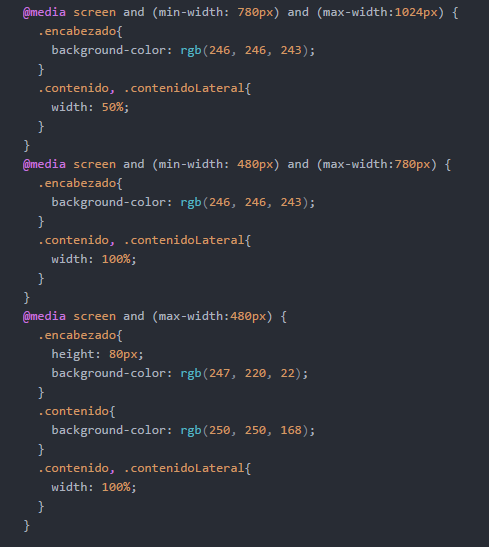
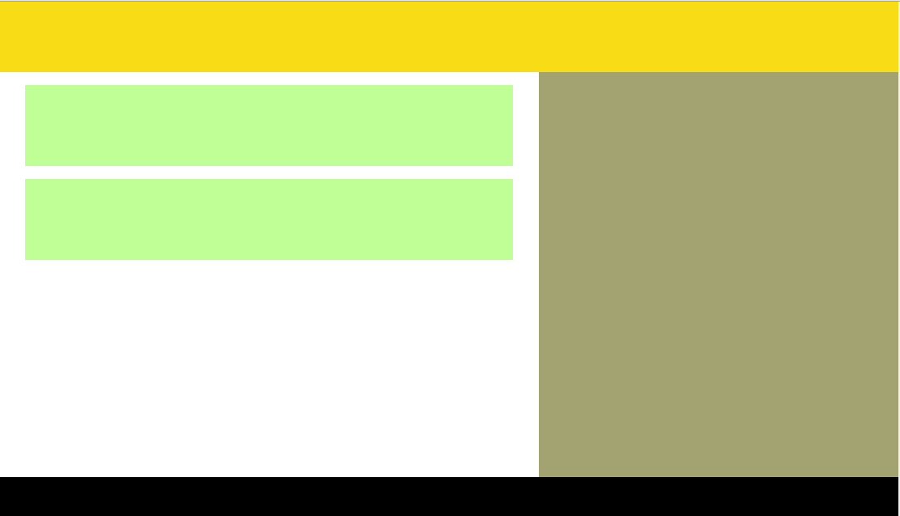
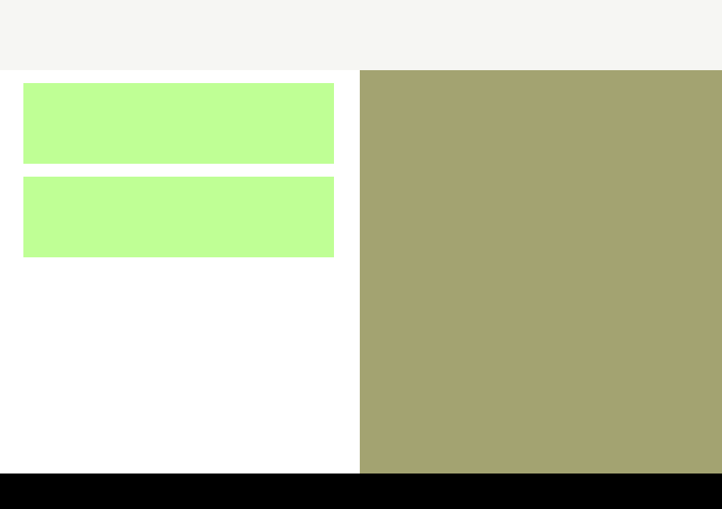
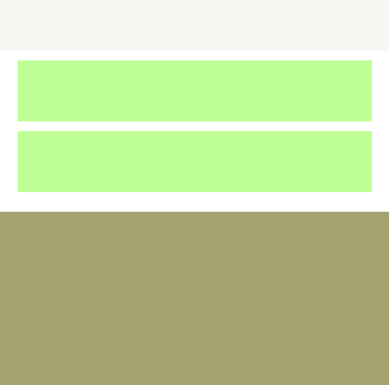
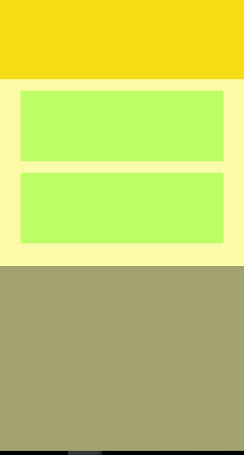

## Practicando Media Queries
las secciones de la pagina web y sus carateristicas como background(color de fondo) y posiciones(una sección sobre otra o al lado de otra) van a cambiar de acuerdo al tamaño de la ventana del navegador (tamaño en pixeles).

 APROXIMADAMENTE 1200px

 APROXIMADAMENTE 800px
 

 APROXIMADAMENTE 600px

 APROXIMADAMENTE 400px

